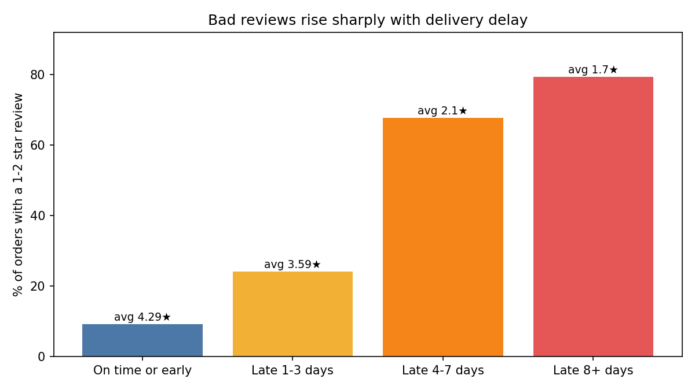

# Olist E-commerce Analysis: Lead Funnel + Delivery & Retention

SQL-first analysis of the public Olist Brazilian e-commerce data (≈100k orders, 2016–2018) plus the Olist marketing-funnel data.
Data: [Brazilian E-Commerce by Olist](https://www.kaggle.com/datasets/olistbr/brazilian-ecommerce) · [Marketing Funnel by Olist](https://www.kaggle.com/olistbr/marketing-funnel-olist)
Tools: DuckDB (SQL), Python (pandas, SciPy, statsmodels, matplotlib). Currency is Brazilian reais (R$).

## Business questions
1. **Part 1 – Which lead channels turn into closed deals, and how fast?**
2. **Part 2 – Does late delivery hurt reviews and repeat purchases, and where do delays happen?**

---
## Part 2 – Delivery, reviews and retention (96,470 delivered orders)



| Delivery vs estimated date | Orders | Avg review | % 1–2 stars |
|---|---|---|---|
| On time or early | 88,163 | 4.29 | 9.2% |
| Late 1–3 days | 3,132 | 3.59 | 24.1% |
| Late 4–7 days | 1,748 | 2.10 | 67.7% |
| Late 8+ days | 2,781 | 1.70 | 79.3% |

**Findings**
1. **Reviews collapse once an order is more than ~3 days late.** 1–2 star reviews go from 9% (on time) to 68–79% (4+ days late).
2. **Late orders are ~8% of orders but 33.8% of all 1–2 star reviews** (4,142 of 12,272). Delivery performance is the single biggest fixable lever on review scores in this data.
3. **Late first deliveries are associated with a slightly lower repeat-purchase rate**: 2.50% vs 3.05% (p = 0.0075 unadjusted). After controlling for purchase month (late orders cluster in months where customers had less time to return), the odds ratio is **0.86 (95% CI 0.74–1.00, p = 0.054)**. The direction is consistent, but the evidence is **suggestive, not conclusive**.
4. **The repeat-purchase effect is small in money terms.** Only ~3% of customers ever buy again. Closing the raw 0.55-point gap for the 7,603 customers whose first order was late would bring back ~40 buyers; at the average order value of R$161 that is roughly R$7k, against R$16.0M total payments. The business case for fixing delays rests on **review scores and reputation**, not on repeat revenue, based on this data.
5. **Delays are concentrated in time and place.** Late share spiked to 14.3% in Nov 2017 and 16.0% / 21.4% in Feb / Mar 2018 (vs ~3–5% in normal months). By destination state, the Northeast and Rio lag the most (MA 19.7%, CE 15.3%, BA 14.0%, RJ 13.5%) vs 5–6% in SP, MG and PR. The data does not show *why* (seller, carrier or capacity); that needs a seller-level follow-up.

**Limits.** This is observational: late orders may differ from on-time ones (remote regions, product types), so "associated with" is the honest wording, not "caused by". Reviews exist for 95,824 of 96,470 delivered orders; 547 orders had two reviews and the latest one was kept. 8 orders marked delivered have no delivery date and are excluded. Customers are counted by `customer_unique_id` (the `customer_id` column is per-order).

---
## Part 1 – Marketing funnel (8,000 leads, 842 closed deals)

Comparison uses leads first contacted **Jan–Apr 2018** (4,695 leads, 651 wins, 13.9% overall).

| Channel | Leads | Conversion | 95% CI |
|---|---|---|---|
| paid_search | 916 | 15.8% | 13.6–18.3 |
| direct_traffic | 302 | 15.6% | 11.9–20.1 |
| organic_search | 1,392 | 15.3% | 13.5–17.3 |
| referral | 158 | 10.1% | 6.3–15.8 |
| social | 782 | 7.0% | 5.4–9.0 |
| email | 253 | 4.7% | 2.7–8.1 |

1. **Paid search does not convert better than organic** (15.8% vs 15.3%, p = 0.73). No cost data exists, so this says nothing about ROI.
2. **Social and email convert at less than half the rate of search** (p < 0.001). Social is 16.7% of leads but 8.4% of wins, and closes slowest (median 30 days vs 10–15).
3. **~15% of leads have an `unknown`/missing source** and convert best (21.5%), so the label is unusable; fixing source tracking comes first.
4. Overall median time to close is 14 days (p75 = 55, p90 = 162). Landing pages range from 24.1% to 3.7% conversion but are likely confounded with channel.

**Data issues.** `closed_deals` has no wins before 2017-12-05, so 2017 leads look like 1–5% conversion vs ~14% in 2018. This is a coverage artifact, so channel analysis is restricted to Jan–Apr 2018. One deal was won 2 days before first contact. ~92% of the optional seller-profile columns are null and `declared_monthly_revenue` is 0 for 95% of deals, so revenue/ROI analysis is not possible. Segment fields exist only for won deals, so no segment conversion rates.

---
## Project structure
```
sql/
  01_load_marketing_funnel.sql   02_data_quality_funnel.sql   03_channel_conversion.sql
  04_time_to_close.sql           05_monthly_cohorts.sql
  06_load_core_tables.sql        07_delivery_vs_reviews.sql   08_delay_hotspots.sql
scripts/
  run_funnel_analysis.py   (Part 1)       run_part2.py   (Part 2)
reports/                   result CSVs and charts
```

## How to run
```bash
pip install -r requirements.txt
# download the 9 core CSVs + 2 funnel CSVs from Kaggle into data/
python scripts/run_funnel_analysis.py
python scripts/run_part2.py
```
